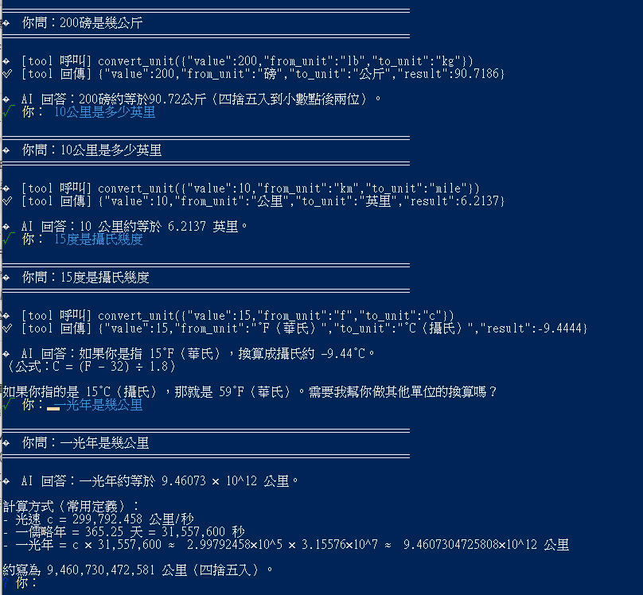

# 作業 2：Function Calling — 單位換算工具

> AI Agent 實作工作坊（JavaScript 版）— 作業 2
> 新增 `convert_unit` 工具，讓 AI 能透過 Function Calling 進行單位換算

## 工具能力

`convert_unit` 支援三組雙向換算（共 6 個方向）：

| 類別 | 換算方向 | 公式 |
|---|---|---|
| 溫度 | 攝氏 ↔ 華氏 | °F = °C × 9/5 + 32 |
| 距離 | 公里 ↔ 英里 | 1 km = 0.621371 mile |
| 重量 | 公斤 ↔ 磅 | 1 kg = 2.20462 lb |

支援多種單位名稱寫法（中、英、縮寫）：例如 `攝氏` / `celsius` / `c` / `°C` 都會被正確解析（見 [`tools/convertUnit.js`](./tools/convertUnit.js) 的 `UNIT_ALIASES`）。

## 環境需求

- Node.js >= 22
- OpenAI API key

## 安裝與執行

```powershell
# 1. 安裝套件
npm install

# 2. 設定 .env
Copy-Item .env.example .env
# 編輯 .env,填入 OPENAI_API_KEY

# 3. 跑作業驗收的互動式 Function Calling 測試
npm test            # = node function_call.js

# 4. 互動式聊天版本（加分：有對話記憶 + system prompt）
npm start           # = node main.js
```

## 檔案結構

```
ai-agent-hw2/
├── tools/
│   └── convertUnit.js   # ⭐ 工具核心：JSON Schema + 實作 + 別名表 + 公式表
├── lib/openai.js        # OpenAI client 封裝（client + DEFAULT_MODEL）
├── utils/spinner.js     # CLI 載入動畫（ora）
├── db/messages.js       # 對話歷史儲存（lowdb，給 main.js 用）
├── function_call.js     # ⭐ 主測試程式：互動式 Function Calling 展示
├── main.js              # 互動式版本：對話迴圈 + tool calling + 記憶
├── config.js            # 讀 .env
├── package.json
├── .env.example
├── .gitignore
└── .history/            # main.js 每次跑會在這裡留對話紀錄
```

## 工具註冊

依照教材的寫法，把工具的 import 跟註冊資料直接放在 `function_call.js` 和 `main.js` 的開頭：

```js
import { convertUnitTool, convertUnit } from "./tools/convertUnit.js";

// ===== 工具註冊中心 =====
const AVAILABLE_TOOLS = {
  convert_unit: convertUnit,
};

const tools = [convertUnitTool];
// ========================
```

- `AVAILABLE_TOOLS` = 工具名稱 → 實際函數的對應表（AI 呼叫時 dispatcher 查表用）
- `tools` = schema 陣列（傳給 OpenAI，告訴它有哪些工具可用）

未來要加新工具，改這兩個變數即可。

## JSON Schema 定義

完整定義見 [`tools/convertUnit.js`](./tools/convertUnit.js)：

```js
{
  type: "function",
  function: {
    name: "convert_unit",
    description: "進行單位換算。支援三組單位的雙向換算：攝氏(°C) ↔ 華氏(°F)、公里(km) ↔ 英里(mile)、公斤(kg) ↔ 磅(lb)。",
    parameters: {
      type: "object",
      properties: {
        value:     { type: "number", description: "要換算的數值，例如 25" },
        from_unit: { type: "string", description: "原始單位..." },
        to_unit:   { type: "string", description: "目標單位..." }
      },
      required: ["value", "from_unit", "to_unit"]
    }
  }
}
```

**設計重點：**
- `value` 用 `number`，AI 傳字串會被工具回傳 error
- `from_unit` / `to_unit` 用 `string` 而非 `enum`，並在 `description` 列出可接受的別名 — 這樣 AI 從自然語言抓單位時不會被嚴格限制，工具內部的 `UNIT_ALIASES` 表負責正規化
- 三個都列在 `required`，確保 AI 不會漏傳

## 錯誤處理

工具回傳的 error 物件範例（仿 weather 工具格式）：

```json
// value 不是數字
{ "error": "value 必須是數字，收到的是: \"攝氏\"" }

// 跨類別換算
{
  "error": "不支援的單位組合：公斤 → 英里（只能在同類別內換算，例如溫度↔溫度、長度↔長度、重量↔重量）",
  "supported_conversions": ["c->f","f->c","km->mi","mi->km","kg->lb","lb->kg"]
}

// 不認識的單位
{
  "error": "不支援的原始單位「光年」",
  "supported_units": ["°C（攝氏）","°F（華氏）","公里","英里","公斤","磅"]
}
```

---

## 驗收標準對照

| 項目 | 達成狀況 |
|---|---|
| 單位換算工具包含完整的工具定義和實作 | ✅ [`tools/convertUnit.js`](./tools/convertUnit.js) — schema 定義 + `convertUnit()` 實作 + 別名表 + 公式表 + 錯誤處理 |
| JSON Schema 定義正確（type、function、parameters） | ✅ 含 `type: "function"`、`function.name/description`、`parameters.type/properties/required`，三個參數都有 type 與 description |
| AI 能從自然語言問題正確理解並參數化呼叫換算工具 | ✅ 見下方實測：4 種不同自然語言問法都成功解析成 `convert_unit(value, from_unit, to_unit)` 呼叫 |
| 換算結果正確（至少測試 3 種不同單位組合） | ✅ 實測涵蓋 4 種組合：磅→公斤、公里→英里、華氏→攝氏，以及一個未支援單位（光年）的觀察 |

---

## 實測對話紀錄

執行截圖：



實測逐字稿如下。

### 測試 1：反向換算（磅 → 公斤）

**你問：** 200磅是幾公斤

```
🔧 [tool 呼叫] convert_unit({"value":200,"from_unit":"lb","to_unit":"kg"})
✅ [tool 回傳] {"value":200,"from_unit":"磅","to_unit":"公斤","result":90.7186}
```

**🤖 AI 回答：** 200磅約等於90.72公斤（四捨五入到小數點後兩位）。

✅ **驗證：** 200 ÷ 2.20462 ≈ 90.7186，計算正確。AI 主動把 4 位小數四捨五入到 2 位，自然口語化。

---

### 測試 2：距離換算（公里 → 英里）

**你問：** 10公里是多少英里

```
🔧 [tool 呼叫] convert_unit({"value":10,"from_unit":"km","to_unit":"mile"})
✅ [tool 回傳] {"value":10,"from_unit":"公里","to_unit":"英里","result":6.2137}
```

**🤖 AI 回答：** 10 公里約等於 6.2137 英里。

✅ **驗證：** 10 × 0.621371 ≈ 6.2137，計算正確。注意 AI 傳的是 `to_unit: "mile"` 而非 `"mi"` — 工具的 `UNIT_ALIASES` 表把這兩個都當成英里處理。

---

### 測試 3：模糊問題的處理（沒講「攝氏還華氏」）

**你問：** 15度是攝氏幾度

```
🔧 [tool 呼叫] convert_unit({"value":15,"from_unit":"f","to_unit":"c"})
✅ [tool 回傳] {"value":15,"from_unit":"°F（華氏）","to_unit":"°C（攝氏）","result":-9.4444}
```

**🤖 AI 回答：**
> 如果你是指 15°F（華氏），換算成攝氏約 −9.44°C。
> （公式：C = (F − 32) ÷ 1.8）
> 如果你指的是 15°C（攝氏），那就是 59°F（華氏）。需要我幫你做其他單位的換算嗎？

🔍 **觀察重點：** 使用者沒明確指定來源單位是攝氏或華氏。AI 做了一個推測（猜華氏，因為「15 度是攝氏幾度」這句結構暗示 15 度 ≠ 攝氏），呼叫工具，**並且主動補上另一種可能性的答案**。這是個很好的「自然語言模糊處理」範例 — schema 沒辦法強制 AI 釐清，AI 自己會用對話技巧補救。

---

### 測試 4：未支援的單位 — AI 何時選擇不用工具？

**你問：** 一光年是幾公里

**🤖 AI 回答（直接回，沒呼叫 tool）：**
> 一光年約等於 9.46073 × 10^12 公里。
>
> 計算方式（常用定義）：
> - 光速 c = 299,792.458 公里/秒
> - 一儒略年 = 365.25 天 = 31,557,600 秒
> - 一光年 = c × 31,557,600 ≈ 2.99792458×10^5 × 3.15576×10^7 ≈ 9.4607304725808×10^12 公里
>
> 約寫為：9,460,730,472,581 公里（四捨五入）。

🔍 **觀察重點（關鍵）：** AI **沒有**呼叫 `convert_unit`，因為它看 schema 的 description 知道工具只支援 km/mi/kg/lb/°C/°F，光年不在內。`function_call.js` 沒有設定 system prompt 強迫使用工具，所以 AI 用自己的知識回答。

**這個行為其實展現了 Function Calling 的設計哲學：tool_choice: "auto" 讓 AI 自由決定要不要用工具。** 如果要強制 AI 一定要呼叫工具（不支援就回 error），可以：
1. 改 `tool_choice: "required"`
2. 在 system prompt 寫「任何單位換算都必須呼叫 convert_unit，不准自己算」 — 這正是 `main.js` 採用的策略

---

## 心得

這次作業最有感的觀察：**Function Calling 不是 AI 真的「會算數」，而是 AI 學會「在什麼情況下，要拿什麼參數呼叫哪個函數」**。

具體說，AI 拿到「200 磅是幾公斤」這句自然語言時：
1. 看 schema 的 description 知道有 `convert_unit` 工具、可接受的單位寫法
2. 自然語言解析 → 抓出 `value=200`、`from_unit="lb"`、`to_unit="kg"`
3. 呼叫工具（這時候真正的數學在我們的 JS 函數裡跑）
4. 把工具回傳的 JSON 翻成口語句子給使用者，還自動把 4 位小數四捨五入到 2 位

實測中三個有趣的觀察：

1. **schema 的 description 直接決定 AI 解析的成功率**：我在 `from_unit` 的 description 裡寫了「c / celsius / 攝氏」三種寫法，AI 才知道使用者打「攝氏」也能對應到 `c`。這比用 `enum` 嚴格限制更彈性，能接住自然語言的混亂。

2. **AI 會主動處理模糊問題**（測試 3）：「15 度是攝氏幾度」沒講原本是哪種單位，AI 自己挑了一個猜測，**並補上另一種解讀**。schema 沒辦法逼 AI 釐清，但 AI 自己會用對話技巧補救。

3. **tool_choice: "auto" 的雙面刃**（測試 4）：AI 看到「光年」不在支援單位內，直接用自己的知識回答，不呼叫工具。這對使用者體驗好，但失去了「工具是真實計算」的保證。如果要把 AI 的「自由發揮」關掉，可以改 `tool_choice: "required"` 或在 system prompt 強制要求 — `main.js` 就是這樣做的。

另一個架構觀察：「工具註冊中心」其實就是 `function_call.js` 和 `main.js` 開頭那幾行 — `tools` 陣列負責把「給 AI 看的菜單（schema）」交出去，`AVAILABLE_TOOLS` 物件負責把「菜名 → 真正做菜的函數」配對起來。AI 在 schema 看到工具能做什麼後，回傳 `tool_calls` 指定要呼叫哪個 name；dispatcher 就拿這個 name 去 `AVAILABLE_TOOLS` 查表執行。所以「註冊」這個動作就是把這兩件事的對應關係建立起來。
